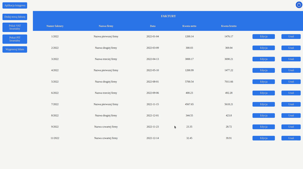

# accounts_workshop

## Table of contents
* [Description](#description)
* [Login data](#logindata)
* [Overview](#overview)
* [Demo](#demo)
* [Technologies](#technologies)

## Description

MVC application was created for archiving invoices of the company and it automatically counts quartely taxes VAT and PIT.

## Login data

Login: user

Password: user

## Overview

Creating a new account:

Logging into the application:

Adding, editing and deleting an invoice:

Other functionalities

## Demo

You can find the demo [here](https://app-palarczyk.herokuapp.com/)

## Technologies
Project is created with:

* HTML
* CSS
* Javascript
* JSP
* Java
* Spring Boot
* Spring Data JPA
* Spring Data JDBC
* Spring Security
* Hibernate

